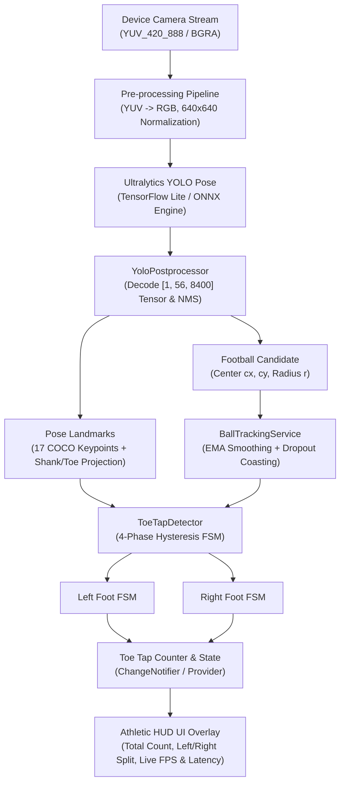

# ⚽ Flickit — Flutter + Computer Vision: Real-time Toe Tap Counter

A mobile application built with **Flutter/Dart** and **Ultralytics YOLO Pose** that detects and counts football toe taps in real-time with sub-millisecond state machine latency and on-device machine learning inference.

---

## 📌 Architecture Overview



---

## 🧠 Toe Tap Detection Approach

In football training drills, a **toe tap** consists of alternating between touching the top surface of a stationary or slow-moving ball with the ball of the foot/toe, followed by an immediate lift-off.

A naive proximity check (`distance < threshold -> count++`) fails in production because:
1. At 30 FPS, a foot resting on the ball for 200ms triggers 6 duplicate counts.
2. A simple timer debounce either misses rapid alternating taps or triggers on hover.
3. During contact, the player's foot partially occludes the ball, causing raw detection dropouts.

To solve this, this application implements a **4-Phase Kinematic Hysteresis Finite State Machine (FSM)** with **Independent Dual-Foot Tracking**:

### 1. Anatomical Foot & Toe Projection
Standard COCO pose estimates 17 keypoints terminating at the ankles (Left Ankle `#15`, Right Ankle `#16`). To model the toe tip:
$$\vec{V}_{\text{shank}} = \mathbf{P}_{\text{ankle}} - \mathbf{P}_{\text{knee}}$$
$$\mathbf{P}_{\text{toe}} = \mathbf{P}_{\text{ankle}} + \beta \cdot \|\vec{V}_{\text{shank}}\| \cdot \hat{u}_{\text{gravity}}$$
This accurately projects the foot contact point toward the ground plane proportional to the user's leg length.

### 2. Dual-Threshold Hysteresis Band
To eliminate boundary oscillation (chatter), contact and separation use separate thresholds relative to the ball radius $r$:
- **Contact Threshold**: $D_{\text{contact}} = \mu_{\text{contact}} \times r \quad (\text{default } 1.25 \times r)$
- **Separation Threshold**: $D_{\text{separation}} = \mu_{\text{sep}} \times r \quad (\text{default } 1.65 \times r)$

Because $D_{\text{separation}} > D_{\text{contact}}$, once a tap is registered, the foot **must** physically lift off and clear the outer hysteresis perimeter before that foot can trigger another tap.

### 3. Directional Kinematic Velocity Check
A valid tap requires downward movement into the top contact zone:
- **Approach**: $\Delta y_{\text{foot}} > 0$ (descending toward ball in screen space).
- **Geometric Containment**: $y_{\text{foot}} \le y_{\text{ball}} + 0.35 \cdot r$ and $|x_{\text{foot}} - x_{\text{ball}}| \le 1.35 \cdot r$. (Ensures taps only register on the *top* hemisphere of the ball, filtering out feet standing behind the ball).
- **Lift-off**: $\Delta y_{\text{foot}} < 0$ (retracting upward).

### 4. Independent Left/Right Foot FSM
The detector maintains two isolated FSM instances (`_leftFoot` and `_rightFoot`). When a player performs rapid alternating taps (Left $\rightarrow$ Right $\rightarrow$ Left), the right foot can enter contact while the left foot is still retracting, providing realistic athletic drill tracking.

---

## 🛡️ Handling Temporary Detection Failures (Occlusion & Coasting)

During foot-ball impact, the ball is often partially occluded by the sole of the foot, which can cause object detectors to drop the ball for 1–3 frames.

The `BallTrackingService` addresses this with:
1. **Exponential Moving Average (EMA) Smoothing**:
   $$\mathbf{C}_t = \alpha \cdot \mathbf{C}_{\text{detected}} + (1 - \alpha) \cdot \mathbf{C}_{t-1}$$
   Eliminates jitter from frame-to-frame bounding box variations.
2. **Dropout Coasting**:
   If raw detection fails, the tracker coasts the ball at its last known position and radius for up to $N = 6$ frames (200ms) with decaying confidence. The UI marks this state as `⚽ BALL (COASTED)`.
3. **Interactive Touch-to-Anchor Fallback**:
   In low-contrast lighting conditions, tapping the screen anywhere on the ball anchors the tracking ROI immediately.

---

## ⚡ Performance Optimization & Lifecycle Management

- **Drop-Frame Throttling**: If a previous frame's neural network inference is still computing, the camera listener immediately drops subsequent frames to ensure the Flutter UI thread never drops below 60 FPS.
- **Hardware Acceleration**: Configured with Android `GpuDelegateV2` and `aaptOptions { noCompress 'tflite' }` for zero-copy memory mapping (`mmap`).
- **App Lifecycle Handling**: Implements `WidgetsBindingObserver` to automatically release the camera hardware and stop inference streams when backgrounded (`paused`), re-initializing seamlessly on `resumed`.
- **Live Telemetry HUD**: Displays real-time Camera FPS, Inference FPS, and Pipeline Latency (ms).
- **Built-in Simulation Mode**: Allows instant evaluation and testing on simulators or desktops without a physical camera or football.

---

## 📦 Dependencies

| Package | Version | Purpose |
|---|---|---|
| `flutter` | `>=3.0.0` | Core UI & framework |
| `provider` | `^6.1.2` | Clean reactive state management |
| `camera` | `^0.10.5+9` | Camera streaming & hardware control |
| `tflite_flutter` | `^0.10.4` | TensorFlow Lite C-API bindings for YOLO inference |
| `image` | `^4.1.7` | High-performance YUV/RGB buffer transformation |
| `flutter_test` | SDK | Automated unit testing for FSM & geometry |

---

## 🚀 Setup & Run Instructions

### Prerequisites
- Flutter SDK `>= 3.10.0`
- Android Studio / Android SDK (API 21+)
- Android device or emulator with camera support

### 1. Clone & Install Dependencies
```bash
git clone https://github.com/your-username/toe_tap_counter.git
cd toe_tap_counter
flutter pub get
```

### 2. Run the App
Connect your Android phone via USB (with USB Debugging enabled) and run:
```bash
flutter run
```

### 3. Run Automated Tests
Verify mathematical geometry and FSM debounce mechanics:
```bash
flutter test
```

### 4. Build Release APK
Generate an optimized release APK:
```bash
flutter build apk --release
```
The APK will be generated at:
`build/app/outputs/flutter-apk/app-release.apk`

---

## 🎮 How to Use

1. Launch the app and grant Camera permissions when prompted.
2. Place your football on the ground in front of you.
3. Position your phone horizontally or vertically so both your legs and the football are visible.
4. Press **START**. The app will lock onto the player skeleton and football.
5. Tap the top of the ball with alternating feet:
   - Each valid tap increments **TOE TAPS** with a green impact ripple and tactile haptic vibration.
   - The HUD displays the real-time breakdown of **LEFT FOOT** and **RIGHT FOOT** taps.
6. Press **RESET** anytime to restart the counter.
7. Tap the **Settings (Sliders)** icon to adjust the contact threshold or toggle **Simulation Mode**.

---

## ⚠️ Known Limitations & Future Enhancements

1. **Monocular 2D Depth Ambiguity**:
   The current model evaluates $(x, y)$ screen space. If a player stands directly in line behind the ball and taps the floor behind it, a 2D camera may see proximity overlap.
   *Future Enhancement*: Incorporate 3D keypoint depth estimation (MediaPipe Z-axis or depth sensor/ARCore).
2. **Camera Motion / Handheld Shaking**:
   Rapid camera movement shifts screen coordinates.
   *Future Enhancement*: Optical flow background subtraction to compensate for camera ego-motion.
3. **Extreme Low-Light Conditions**:
   Dark indoor environments reduce camera sensor exposure and edge detection.
   *Mitigation*: The app includes interactive touch-to-anchor and dropout coasting to maintain stability.
